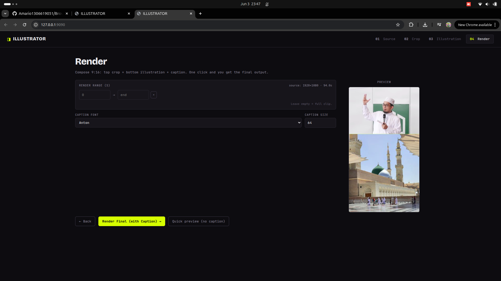

# ILLUSTRATOR

Build 9:16 vertical videos (TikTok/Shorts/Reels) from YouTube — **top slot = a video
clip, bottom slot = an AI-picked illustration (stock photo) that matches what's being
discussed**. Changes every N seconds. Automatic word-by-word captions.

Sibling of `../clipper`. The difference: clipper has 2 video boxes, this has 1 video box + 1 illustration track.



## Flow

1. **Source** — paste a YouTube URL + a time range → download & trim.
2. **Crop** — draw 1 box for the top slot. You can keyframe (pan) + choose a per-segment cover/blur fit.
3. **Illustration** — set the duration per image (N seconds) → "Generate". The AI (Whisper + LLM) reads
   the transcript for each window, finds matching images on Pexels, and offers a few candidates.
   Click to pick one per segment (the first candidate is auto-selected).
4. **Render** — compose + burn captions → 1 mp4 file in `output/`.

## Saving storage

Image candidates are only URLs — loaded directly from Pexels in the browser, **not stored on the server**.
Only the images you pick get downloaded, at render time, at a small size (`portrait` ~800×1200),
and deduped (windows that use the same image share 1 file). Everything is deleted on "Done · clean up".

---

# How to run it (full step-by-step)

## 0. Prerequisites — install these on your computer first

This tool needs 3 programs outside of Python. Check whether you already have them:

```bash
ffmpeg -version
ffprobe -version
node -v
python3 --version    # needs 3.10+
```

If any of them say `command not found`, install them first:

**Linux (Debian/Ubuntu)**
```bash
sudo apt update
sudo apt install -y ffmpeg nodejs python3 python3-venv
```

**macOS (using Homebrew)**
```bash
brew install ffmpeg node python
```

**Windows**
- ffmpeg: download from https://www.gyan.dev/ffmpeg/builds/ → extract → add the `bin/` folder to PATH.
- node: download from https://nodejs.org → install (next-next-finish).
- python: download from https://python.org → install, check **"Add Python to PATH"**.

> `node` is needed by yt-dlp to solve YouTube's "n-challenge". Without node, a download may only get storyboard images.

## 1. Create a virtual env + install Python dependencies

From inside the `illustrator/` folder:

```bash
cd illustrator

python3 -m venv venv
source venv/bin/activate          # Windows: venv\Scripts\activate

pip install --upgrade pip
pip install -r requirements.txt
```

> The first time takes a while — `openai-whisper` pulls in a large PyTorch.

## 2. Get a Pexels API key (free)

This is for searching illustration images.

1. Open https://www.pexels.com/api/ → click **"Get Started"**.
2. **Log in / sign up** for a Pexels account (you can use Google/email).
3. Fill in the short form:
   - *What are you building?* → anything, e.g. **"Personal video tool"**.
   - *Description* → e.g. **"App that makes short videos + automatic illustrations"**.
   - Check agree to terms.
4. Click **Generate API Key** → the key appears immediately in the dashboard (https://www.pexels.com/api/new/).
   It's a long string, e.g. `563492ad6f917000010000019xxxxxxxxxxxxx`.
5. Copy the key (you'll paste it in step 4).

> Free tier: **200 requests/hour**, **20,000/month** — more than enough. You must give attribution
> to Pexels if you publish the video (the photographer's name is tracked automatically).

## 3. Set up LLM access (internal vLLM)

Use the same internal vLLM endpoint as `email_categorizer` — to translate each segment's
topic into image search keywords. All you need is its **`VLLM_API_KEY`**
(the base URL + model already have defaults). Grab it from your own `email_categorizer/.env`.

## 4. Fill in the `.env` file

```bash
cp .env.example .env
```

Open `.env` and fill in these 2 lines (the rest can be left at the defaults):

```ini
VLLM_API_KEY=<vLLM key from email_categorizer>
PEXELS_API_KEY=<Pexels key from step 2>
```

### Optional: speaker diarization (for the auto-box **Diarize** toggle)

Skip this unless you want the "who is speaking" hint. Install the extra deps, then add a token:

```bash
pip install 'pyannote.audio>=4' torchcodec     # torchaudio must match your torch build
```
1. Accept the gated models (free) at <https://huggingface.co/pyannote/speaker-diarization-3.1> **and**
   <https://huggingface.co/pyannote/segmentation-3.0>
2. Create a **read** token at <https://huggingface.co/settings/tokens>
3. Add `HF_TOKEN=hf_xxx` to `.env` (leave empty = diarization off; the Director still decides visually).

## 5. Run the server

```bash
cd backend
python main.py
```

If it works, you'll see `Uvicorn running on http://127.0.0.1:8000`.
Open **http://127.0.0.1:8000** in your browser.

> Stop the server: `Ctrl + C`. Each time you want to run it again, activate the venv first
> (`source venv/bin/activate`), then `cd backend && python main.py`.

## 6. How to use it in the browser (4 steps)

1. **Source** — paste a YouTube URL, fill in Start/End (leave End empty = to the end), click **Download & Trim**.
2. **Crop** — click the **"Crop box"** pill (or press `1`) to activate the canvas → drag on the video
   to create a box (top slot). Want to pan? Scrub to another time and drag again = a new keyframe.
   Each segment row can be toggled **HOLD↔PAN** and **COVER↔BLUR**. Click **Transcribe & Continue**.
   *Or let the AI box it:* type what the crop should follow, drag a time range, hit **Generate**. Two
   toggles: **Director** (slides a window over the clip + reads the transcript → better layout/subject
   choices; a moving subject becomes a smooth **TRACKED** pan instead of going black) and **Diarize**
   (a who-is-speaking hint — needs the optional setup below). Needs `VISION_*` set in `.env`.
3. **Illustration** — set the **duration per illustration** (seconds), click **Generate illustration**.
   A row of image candidates appears for each segment → click to pick one (candidate #1 is auto-selected).
   Keywords not quite right? Edit them in the query box → **search again**. Click **Continue**.
4. **Render** — set the caption font/size (or a render range if you want to trim further) →
   **Render Final (with Caption)**. The result appears + a download button. Click
   **Done · clean up source** when you're done, to delete the temp files.

Output is in `illustrator/output/*.mp4`.

---

## Troubleshooting

| Problem | Solution |
|---|---|
| Download fails / "Sign in to confirm you're not a bot" | Log in to YouTube in Chrome/Firefox once, or set `ILLUSTRATOR_COOKIES_BROWSER=firefox`, or export `cookies.txt` (Netscape) to `illustrator/cookies.txt`. |
| Bottom slot is black on render | `PEXELS_API_KEY` is unset / wrong. Render still runs, just without illustrations. |
| Image candidates empty in Step 3 | Check the Pexels key, or edit the keywords and "search again". |
| Transcribe takes forever | Normal on the first run — Whisper downloads + loads the model. It's fast after that. |
| Indonesian captions not accurate enough | Change the model in `backend/transcriber.py`: `get_model("base")` → `"small"`/`"medium"`. |
| Render is slow | If you have an NVIDIA GPU, NVENC is used automatically. Force CPU: `ILLUSTRATOR_ENCODER=libx264`. |
| Port 8000 in use | Edit the port on the last line of `backend/main.py`. |

## Technical notes

- Without `PEXELS_API_KEY`, the bottom slot will be empty (black) — render still runs.
- The Qwen LLM is sometimes slow/`<think>` — there's a keyword fallback, so it never gets fully stuck.
- Whisper's default model is `base` (mediocre for Indonesian) — change it in `backend/transcriber.py`.
- GPU NVENC is used automatically if available; force CPU: `ILLUSTRATOR_ENCODER=libx264`.
- For full architecture details: see [CLAUDE.md](CLAUDE.md).
